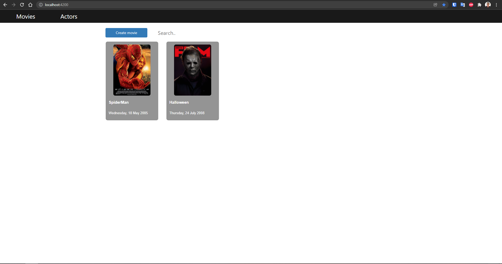

# Movies
This project is the solution to clear's test

## Requirements
- To have installed nodejs
- To have installed Net core 3.1
- To have installed docker and docker-compose
- Do not have an activated instance of SQL Server

## Usage
To be able to use this solucion first we need to download this repo, then we need to execute the backend solution.
This solution is easy to execute, you simply need to run docker-compose up -d, before that, you need to change the conectionString environment variable, you need to change the IP, this IP shouldn't be `localhost` or `127.0.0.1` instead it could be some IP that our router gives us for example `192.168.1.164`.

```YML
version: '3.4'

services:
  movies.api:
    environment:
      - ASPNETCORE_ENVIRONMENT=Development
      - ASPNETCORE_URLS=http://+:80
      - ConnectionString=Server=192.168.1.164;Database=Movies;User Id=SA;Password=testapp123.;
    ports:
      - "5000:80"
```

Once we have this, run the docker-compose with:

```Bash
docker-compose build
docker-compose up -d
```

When the docker-compose is run, you need to execute the frontend project so, we get in to `movies-app` folder and we open a terminal window and write this commands.

```Bash
cd movies-app
npm install
npm install -g @angular/cli
ng s --open
```
If works, go to your browser and type http://localhost:4200 and see the aplication works.


# Desing

## Database

I created 3 tables, these tables are Actors, Movies and ActorMovie which is to show the relation between Actors and Movies.

These tables are shown below:

### Actors
|ActorId|Name|DateOfBirth|
|----|-----|-------|
|int|varchar(255)|Date|

### Movies
|MovieId|Title|Country|Gender|ImageUrl|ReleaseDate|
|----|-----|-------|----|-----|-------|
|int|varchar(255)|varchar(100)|varchar(100)|varchar(1000)|Date

### ActorMovie
|ActorMovieId|MovieId|ActorId|
|----|-----|-------|
|int|int|int|

## Architecture

To develop this architecture I try to use a design pattern called `clean architecture`, The diagram is shown below:


I used different layers to try to represent a simple clean architecture.


## Fronted

This frontend wasn't possible develop in React, instead I used Angular.

I developed 2 functional components which are a `SearchComponent` and `CardComponent` and also I used devextreme to use some components of this framework.

## Screenshots




